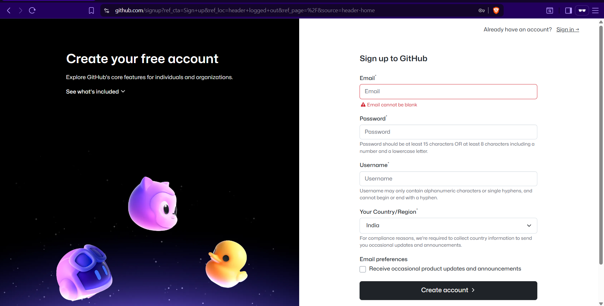
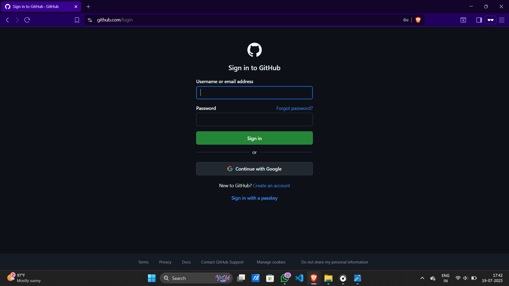
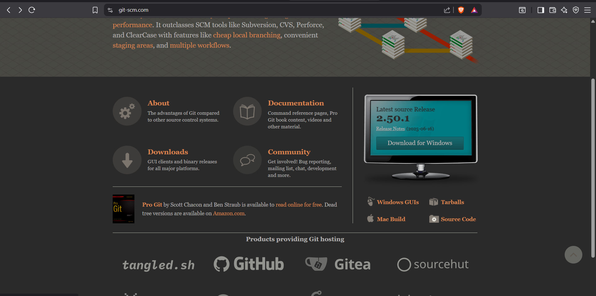
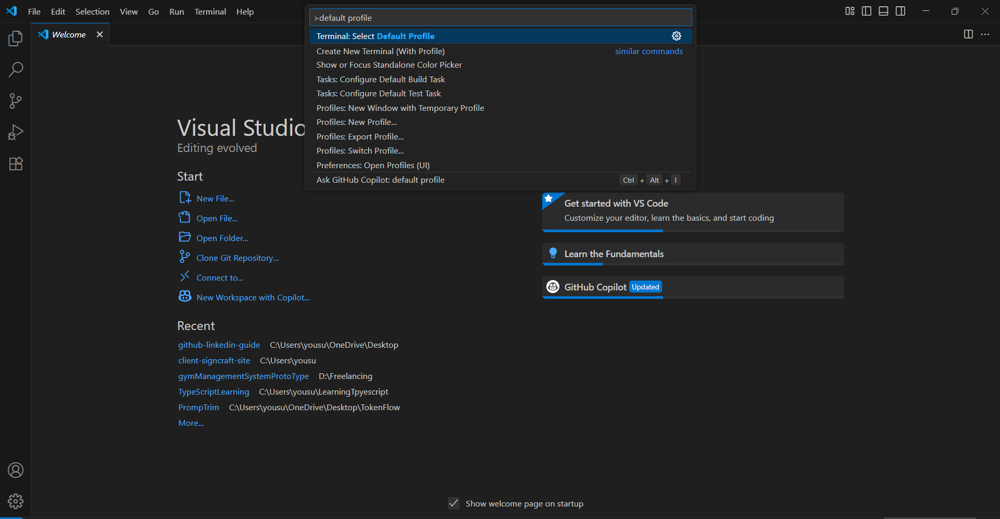
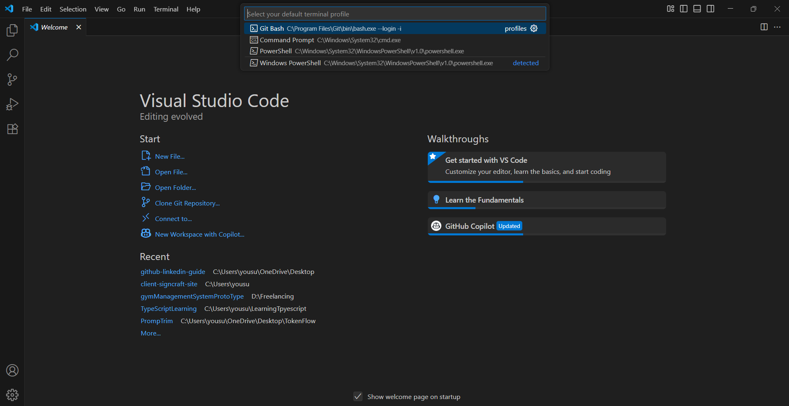
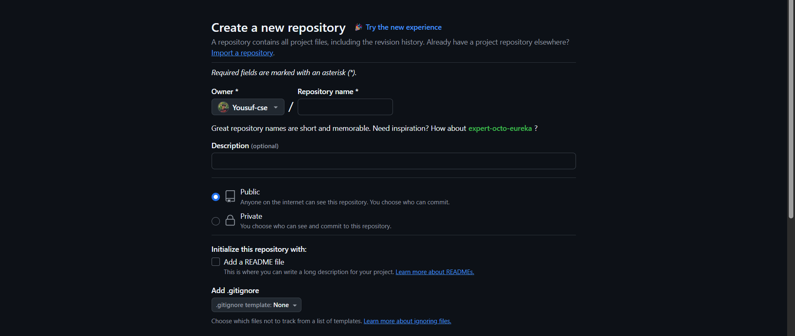
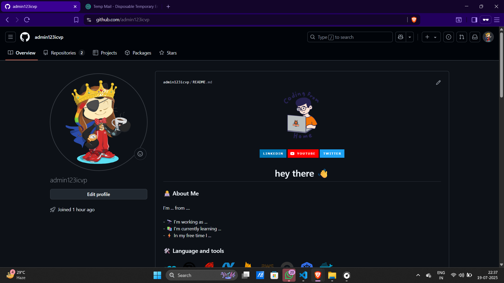

# 🚀 GitHub Setup Guide (Beginner Friendly)

Welcome! This guide will walk you through setting up GitHub for the first time and connecting it with **VS Code** to push your first project.

---

## 🛠️ What You'll Learn

- Create a GitHub account  
- Install Git 
- Create your first repository  
- Connect it to VS Code  
- Push your first "Hello World" project  
- BONUS: Create your GitHub profile README

---

## ✅ Step-by-Step Guide

### 1. Create a GitHub Account
- Go to [github.com](https://github.com)
- Click **Sign Up** and follow the process
- Choose a unique username — this becomes your public profile URL

  

- After successful sign up, you’ll be redirected to the login page

- Log in using the email or username and password you just created

   

---

### 2. Install Git
- Download Git: [https://git-scm.com](https://git-scm.com)

   

*Install and restart your system to ensure environment paths are set.*

---


---
💡 Tip: For better Git integration and smoother terminal experience in VS Code, switch your terminal to Git Bash:

Open VS Code

Press Ctrl + Shift + P → search Select Default Profile



Choose Git Bash



Then restart your terminal (Ctrl + ~) or VS Code

---

### 3. Set Up Git in VS Code

Open VS Code terminal and run:

```bash
git config --global user.name "Your Name"
git config --global user.email "your-email@example.com"
```

✅ This links your Git identity with GitHub.

---

### 4. Create a New GitHub Repository

1. On GitHub, click **New Repo**
2. Name it something like `my-first-repo`
3. Keep it Public (or Private)
4. DO NOT initialize with README (we'll do it manually)



---

### 5. Connect the Repo to VS Code

In VS Code terminal:

```bash
mkdir my-first-repo
cd my-first-repo
git init
touch index.js    # or any file like hello.txt
code .            # open folder in VS Code
```

Now add the remote link:

```bash
git remote add origin https://github.com/yourusername/my-first-repo.git
```

---

### 6. Add Files & Push

Create a simple Hello World file, e.g. `hello.js`:

```js
console.log("Hello World!");
```

Now run:

```bash
git add .
git commit -m "Initial commit with Hello World"
git push -u origin main
```

✅ Done! Your code is now live on GitHub.

---

## 🌟 BONUS: Create Your GitHub Profile README

Make your GitHub profile look **awesome** by showing a custom introduction.

### 🔧 Steps:

1. Create a new repo with the **same name as your username**
   - e.g., if your username is `exampleicvp-dev`, repo should be `exampleicvp-dev`
2. Make it **Public** and **add a README**
3. Add something like:

```markdown
# Hi, I'm xyz! 👋

<div align="center">
  
</div>

###

<div align="center">
  
  
  
</div>

###

<h1 align="center">hey there 👋</h1>

###

<h3 align="left">👩‍💻  About Me</h3>

###

<p align="left">I'm ... from ....<br><br>- 🔭 I’m working as ...<br>- 📚 I'm currently learning ...<br>- ⚡ In my free time I ...</p>

###

<h3 align="left">🛠 Language and tools</h3>

###

<div align="left">
  
  
  
  
  
  
  
  
  
  
  
  
  
  
  
  
  
</div>

###

<h3 align="left">🔥   My Stats :</h3>

###
```



✅ It will show up automatically on your profile!